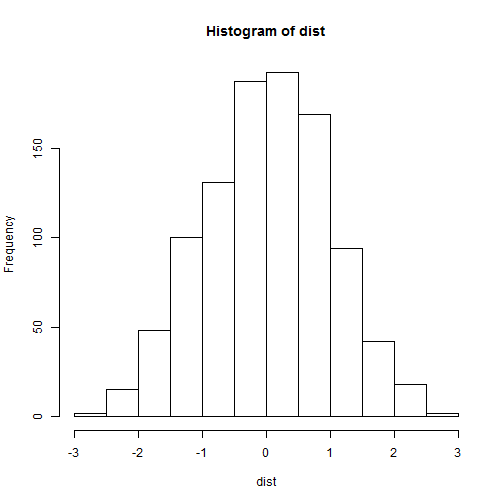

presentation about my data product
========================================================
author: Mario Jimenez Garcia
date: 24/08/2014

Project Developing Data Products
========================================================

**This project has the intention to demonstrate skills learned during this course, for it was the following:**

- It use input textbox, ComboxBox, sliders, panel
- Did some operations, histograms and summary
- Some operation on the ui input in server R and output displayed as a result.
- finally the documentation system was created and each part that composes 

Project Developing Data Products
========================================================

**General and name**

- In this section we can enter our name through a textbox and the information is presented in the tap called

**Histogram**

- In this section and a histogram was created by one sliderinput mediode change the number of observations.

**Summary**

- In this section, select the dataset you wish to query and present a summary of the data but also create a table with the information from the dataset


Code and results about Histogram
========================================================


```r
dist <- rnorm(1000)
hist(dist)
```

 

Code and results about Summary of dataset
========================================================


```r
library(datasets)
summary(pressure)
```

```
  temperature     pressure    
 Min.   :  0   Min.   :  0.0  
 1st Qu.: 90   1st Qu.:  0.2  
 Median :180   Median :  8.8  
 Mean   :180   Mean   :124.3  
 3rd Qu.:270   3rd Qu.:126.5  
 Max.   :360   Max.   :806.0  
```

```r
head(pressure)
```

```
  temperature pressure
1           0   0.0002
2          20   0.0012
3          40   0.0060
4          60   0.0300
5          80   0.0900
6         100   0.2700
```

End
========================================================
This is the program to develop, I appreciate your attention. 

Thanks for everything 

Mario Jimenez G
